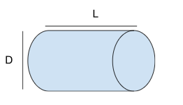
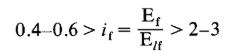
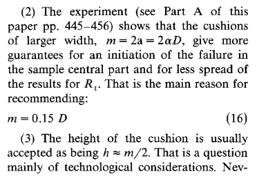

# ICE-mechanics

Lo que no tenemos y que necesitarémos:
  - strain gauge
  - dispositivo para medir ultrasonido
  - pirometro optico
  - papel cocina / paños

Recordamos que la tensión (uniaxial) necesaria para romper la muestra, aplicando una fuerza P es la siguiente (en teoría) :

$$\sigma=\frac{2P}{\pi DL}$$

# DEBEMOS ESTIMAR
Carga máxima estimada
Desplazamiento máximo estimado
Velocidad de desplazamiento deseada

Nuestro caso : $D = 9$ cm, $L < 20$ cm

Bibliografía sobre “ensayos brasileños” con hielo (o hielo de mar) :

[https://www.sciencedirect.com/science/article/pii/S0029801822027718](https://www.sciencedirect.com/science/article/pii/S0029801822027718) (sea ice on the field)
https://www.researchgate.net/publication/360635562_Experiments_on_an_ice_ball_impacting_onto_a_rigid_target (freshwater ice in the lab)
https://www.sciencedirect.com/science/article/pii/016790319191035G  (investigation on the contact condition, but with rock specimens)

En (1), los soportes son piezas de madera, sotenidas con una estructura de plastico.

En (2), los soportes son placas de polycarbonato (una abajo y una arriba). Se puede ponerlas en el freezer antes de los experimentos para que la muestra no se funda durante el ensayo.

En (3), se sugieren condiciones óptimas para repartir correctamente las tensiones en el material (y que la fractura no se inicie cerca de un punto de contacto) son las siguientes :

(con E_f y E_lf los modulos de young de la muestra y del soporte (loading device))

Se afirma tambien :

Primer ensayo :

Lo que vamos a hacer :

romper 1 o 2 muestras de hielo (1 cubo, tal vez un cilindro tambien que podemos hacer con una botella de coca) 

un film del lado (con camera basler) para ver si podemos medir desplazamientos

